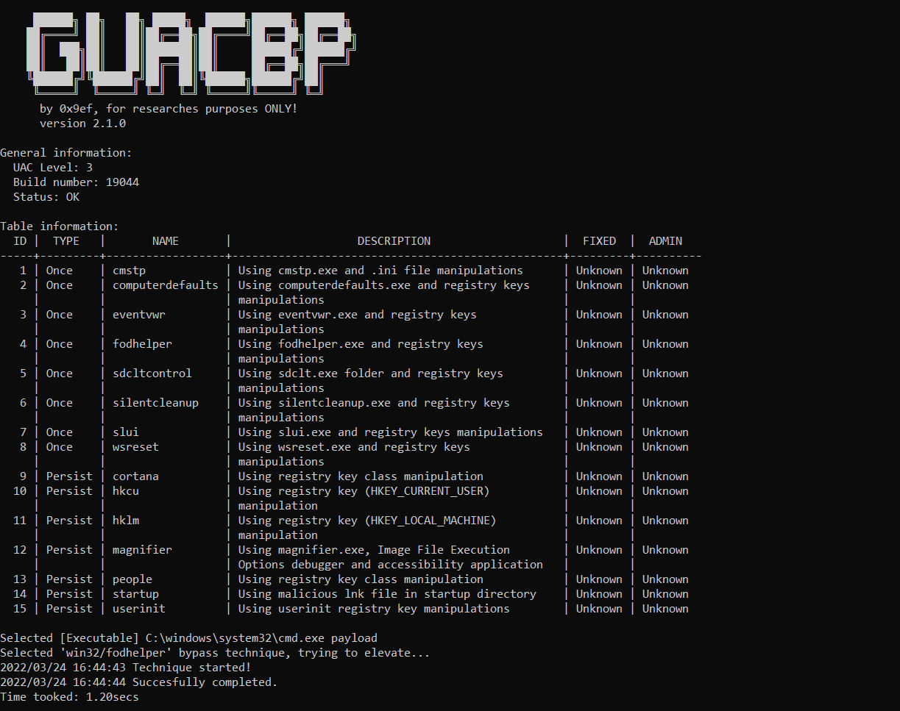

# Golang UAC Bypasser
Collection of bypass techiques written in Golang.

Rewrite of - https://github.com/rootm0s/WinPwnage to Golang. 



Techniques are found online, on different blogs and repos here on GitHub. I do not take credit for any of the findings, thanks to all the researchers. 

## Techniques implemented:
### Once
* Using cmstp.exe
* Using computerdefaults.exe
* Using eventvwr.exe
* Using fodhelper.exe
* Using sdcltcontrol.exe
* Using silentcleanup.exe
* Using slui.exe
* Using wsreset.exe

### Persist
* Using Cortana
* Using HKCU registry key manipulations
* Using HKLM registry key manipulations
* Using magnifier.exe
* Using People
* Using Startup folder and malicious lnk file
* Using Userinit registry key manipulations

## How to build: 
  1. `set CGO_ENABLED=0`
  2. `go build -v -a main.go`

## How to use:
You can use this as a library for single method calls to the executor. 
```go
package main 

import (
  once "github.com/0x9ef/golang-uacbypasser/once"
)

func main() {
  path := os.Args[1]
  tstart := time.Now()
  err := once.ExecFodhelper(path)
  if err != nil {
    panic(err)
  }
  tend := time.Now()
  fmt.Printf("Time tooked: %.2f\n", tend.Sub(tstart).Seconds())
}
```

You can use as a program which automatically calling selected methods. 
More information you can found by passing --help flag.
```
main.exe --list --once --technique=TECHNIQUE
```

## If you find error in the code or you want to support project please commit this changes. 
